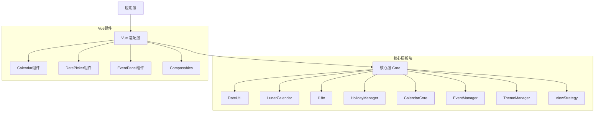
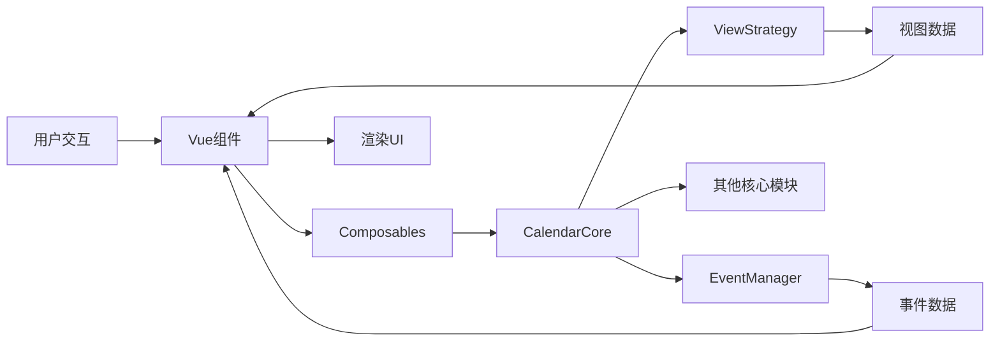

# 日历插件架构设计文档

## 1. 项目概述

这是一个功能强大、框架无关的日历插件，采用核心层 + 框架适配层的架构设计。

### 1.1 核心特性

- ✅ **多视图支持**：月视图、周视图、日视图
- ✅ **事件管理**：创建、编辑、删除事件，支持事件冲突检测
- ✅ **日期选择器**：单日期选择、日期范围选择
- ✅ **国际化**：完整的多语言支持
- ✅ **农历支持**：农历显示、节气、传统节日
- ✅ **节假日标记**：内置节假日数据，支持自定义
- ✅ **主题系统**：基于 CSS 变量的主题定制
- ✅ **高性能**：虚拟滚动、事件优化、按需加载

### 1.2 技术栈

- **核心层 (@ldesign/calendar-core)**
  - TypeScript 5.x
  - 无框架依赖
  - 纯函数式设计
  
- **Vue 适配层 (@ldesign/calendar-vue)**
  - Vue 3.x
  - Composition API
  - TypeScript
  - CSS Modules / CSS Variables

## 2. 架构设计

### 2.1 整体架构图



### 2.2 数据流架构



### 2.3 核心模块设计

#### 2.3.1 DateUtil (日期工具类)

**职责**：提供日期计算、格式化、解析等基础功能

```typescript
class DateUtil {
  // 日期格式化
  static format(date: Date, pattern: string): string
  
  // 日期解析
  static parse(dateStr: string, pattern: string): Date
  
  // 日期计算
  static addDays(date: Date, days: number): Date
  static addMonths(date: Date, months: number): Date
  static addYears(date: Date, years: number): Date
  static getDaysInMonth(year: number, month: number): number
  static getWeekOfYear(date: Date): number
  static getStartOfMonth(date: Date): Date
  static getEndOfMonth(date: Date): Date
  static getStartOfWeek(date: Date, firstDayOfWeek: number): Date
  static getEndOfWeek(date: Date, firstDayOfWeek: number): Date
  
  // 日期比较
  static isSameDay(date1: Date, date2: Date): boolean
  static isSameMonth(date1: Date, date2: Date): boolean
  static isSameYear(date1: Date, date2: Date): boolean
  static isToday(date: Date): boolean
  static isBetween(date: Date, start: Date, end: Date): boolean
  static isBefore(date1: Date, date2: Date): boolean
  static isAfter(date1: Date, date2: Date): boolean
  
  // 工作日判断
  static isWeekend(date: Date): boolean
  static isWeekday(date: Date): boolean
  
  // 日期差计算
  static diffInDays(date1: Date, date2: Date): number
  static diffInMonths(date1: Date, date2: Date): number
}
```

#### 2.3.2 LunarCalendar (农历模块)

**职责**：农历转换、节气计算

```typescript
interface LunarDate {
  lunarYear: number
  lunarMonth: number
  lunarDay: number
  isLeapMonth: boolean
  yearChinese: string // 甲子年
  monthChinese: string // 正月、二月...
  dayChinese: string // 初一、初二...
  zodiac: string // 生肖
  solarTerm?: string // 节气
}

class LunarCalendar {
  // 公历转农历
  static solarToLunar(date: Date): LunarDate
  
  // 农历转公历
  static lunarToSolar(year: number, month: number, day: number, isLeap: boolean): Date
  
  // 获取节气
  static getSolarTerm(date: Date): string | null
  
  // 获取传统节日
  static getTraditionalFestival(lunarDate: LunarDate): string | null
  
  // 获取生肖
  static getZodiac(year: number): string
  
  // 天干地支
  static getGanZhi(year: number): string
}
```

#### 2.3.3 I18n (国际化模块)

**职责**：多语言支持

```typescript
type Locale = 'zh-CN' | 'zh-TW' | 'en-US' | 'ja-JP' | string

interface I18nMessages {
  weekdays: string[]
  weekdaysShort: string[]
  weekdaysMin: string[]
  months: string[]
  monthsShort: string[]
  today: string
  clear: string
  confirm: string
  cancel: string
  year: string
  month: string
  week: string
  day: string
  // ... 更多翻译
}

class I18n {
  private locale: Locale
  private messages: Map<Locale, I18nMessages>
  
  constructor(locale: Locale = 'zh-CN')
  
  setLocale(locale: Locale): void
  getLocale(): Locale
  t(key: string, params?: Record<string, any>): string
  registerMessages(locale: Locale, messages: I18nMessages): void
}
```

#### 2.3.4 HolidayManager (节假日模块)

**职责**：节假日管理

```typescript
interface Holiday {
  date: string // YYYY-MM-DD
  name: string
  type: 'public' | 'traditional' | 'custom'
  isOff: boolean // 是否放假
  description?: string
}

class HolidayManager {
  private holidays: Map<string, Holiday>
  
  addHoliday(holiday: Holiday): void
  removeHoliday(date: string): void
  getHoliday(date: Date): Holiday | null
  isHoliday(date: Date): boolean
  getHolidaysInMonth(year: number, month: number): Holiday[]
  getHolidaysInYear(year: number): Holiday[]
  loadPresetHolidays(country: string): void
  clearAllHolidays(): void
}
```

#### 2.3.5 CalendarCore (日历核心状态)

**职责**：日历状态管理和核心逻辑

```typescript
type ViewMode = 'month' | 'week' | 'day'

interface CalendarState {
  currentDate: Date
  selectedDate: Date | null
  selectedRange: { start: Date; end: Date } | null
  viewMode: ViewMode
  showWeekNumber: boolean
  showLunar: boolean
  firstDayOfWeek: 0 | 1 // 0=Sunday, 1=Monday
}

interface CalendarOptions {
  defaultDate?: Date
  viewMode?: ViewMode
  minDate?: Date
  maxDate?: Date
  disabledDates?: Date[]
  disabledWeekdays?: number[]
  showWeekNumber?: boolean
  showLunar?: boolean
  firstDayOfWeek?: 0 | 1
  locale?: string
}

class CalendarCore {
  private state: CalendarState
  private options: CalendarOptions
  private eventManager: EventManager
  private i18n: I18n
  private holidayManager: HolidayManager
  private observers: Set<(state: CalendarState) => void>
  
  constructor(options: CalendarOptions)
  
  // 状态管理
  getState(): CalendarState
  setState(state: Partial<CalendarState>): void
  subscribe(observer: (state: CalendarState) => void): () => void
  
  // 日期导航
  goToDate(date: Date): void
  goToToday(): void
  nextMonth(): void
  prevMonth(): void
  nextWeek(): void
  prevWeek(): void
  nextDay(): void
  prevDay(): void
  
  // 视图切换
  setViewMode(mode: ViewMode): void
  
  // 日期选择
  selectDate(date: Date): void
  selectRange(start: Date, end: Date): void
  clearSelection(): void
  
  // 日期禁用判断
  isDateDisabled(date: Date): boolean
  isDateSelectable(date: Date): boolean
  
  // 获取视图数据
  getViewData(): MonthViewData | WeekViewData | DayViewData
}
```

#### 2.3.6 EventManager (事件管理)

**职责**：日程事件的增删改查

```typescript
interface CalendarEvent {
  id: string
  title: string
  description?: string
  start: Date
  end: Date
  allDay: boolean
  color?: string
  backgroundColor?: string
  borderColor?: string
  category?: string
  reminder?: number // 分钟
  recurrence?: RecurrenceRule
  metadata?: Record<string, any>
}

interface RecurrenceRule {
  frequency: 'daily' | 'weekly' | 'monthly' | 'yearly'
  interval: number
  endDate?: Date
  count?: number
  byWeekday?: number[]
  byMonthday?: number[]
}

class EventManager {
  private events: Map<string, CalendarEvent>
  private observers: Set<() => void>
  
  // CRUD 操作
  addEvent(event: CalendarEvent): void
  addEvents(events: CalendarEvent[]): void
  updateEvent(id: string, event: Partial<CalendarEvent>): void
  removeEvent(id: string): void
  removeEvents(ids: string[]): void
  getEvent(id: string): CalendarEvent | null
  getAllEvents(): CalendarEvent[]
  
  // 查询
  getEventsInRange(start: Date, end: Date): CalendarEvent[]
  getEventsOnDate(date: Date): CalendarEvent[]
  getEventsInMonth(year: number, month: number): CalendarEvent[]
  searchEvents(keyword: string): CalendarEvent[]
  
  // 冲突检测
  hasConflict(event: CalendarEvent): boolean
  getConflictingEvents(event: CalendarEvent): CalendarEvent[]
  
  // 重复事件展开
  expandRecurringEvent(event: CalendarEvent, start: Date, end: Date): CalendarEvent[]
  
  // 订阅变更
  subscribe(observer: () => void): () => void
  
  // 导入导出
  exportToICS(): string
  importFromICS(icsData: string): void
  exportToJSON(): string
  importFromJSON(jsonData: string): void
}
```

#### 2.3.7 ThemeManager (主题系统)

**职责**：主题管理和 CSS 变量控制

```typescript
interface Theme {
  name: string
  variables: ThemeVariables
}

interface ThemeVariables {
  // 颜色
  primaryColor: string
  backgroundColor: string
  textColor: string
  textSecondaryColor: string
  borderColor: string
  hoverColor: string
  selectedColor: string
  selectedTextColor: string
  disabledColor: string
  disabledTextColor: string
  todayColor: string
  weekendColor: string
  
  // 尺寸
  cellWidth: string
  cellHeight: string
  fontSize: string
  fontSizeSmall: string
  borderRadius: string
  spacing: string
  
  // 其他
  fontFamily: string
  boxShadow: string
  transition: string
}

class ThemeManager {
  private themes: Map<string, Theme>
  private currentTheme: string
  private customVariables: Partial<ThemeVariables>
  
  constructor()
  
  registerTheme(theme: Theme): void
  setTheme(name: string): void
  getCurrentTheme(): Theme
  getThemeNames(): string[]
  applyThemeVariables(variables: Partial<ThemeVariables>): void
  resetTheme(): void
  
  // 内置主题
  static readonly DEFAULT_THEME: Theme
  static readonly DARK_THEME: Theme
  static readonly LIGHT_THEME: Theme
}
```

#### 2.3.8 ViewStrategy (视图渲染策略)

**职责**：生成不同视图所需的数据结构

```typescript
interface DayCell {
  date: Date
  dateString: string // YYYY-MM-DD
  dayOfMonth: number
  dayOfWeek: number
  isCurrentMonth: boolean
  isToday: boolean
  isWeekend: boolean
  isDisabled: boolean
  isSelected: boolean
  isInRange: boolean
  lunarInfo?: LunarDate
  holiday?: Holiday
  events: CalendarEvent[]
  eventCount: number
}

interface WeekRow {
  weekNumber?: number
  days: DayCell[]
}

interface MonthViewData {
  year: number
  month: number
  weeks: WeekRow[]
  totalDays: number
}

interface WeekViewData {
  year: number
  weekNumber: number
  days: DayCell[]
  startDate: Date
  endDate: Date
}

interface DayViewData {
  date: Date
  dayInfo: DayCell
  hours: HourSlot[]
}

interface HourSlot {
  hour: number
  hourString: string
  events: CalendarEvent[]
  hasEvents: boolean
}

abstract class ViewStrategy {
  protected calendar: CalendarCore
  
  constructor(calendar: CalendarCore)
  abstract generateViewData(date: Date): any
}

class MonthViewStrategy extends ViewStrategy {
  generateViewData(date: Date): MonthViewData {
    // 生成月视图的 6 周数据
  }
}

class WeekViewStrategy extends ViewStrategy {
  generateViewData(date: Date): WeekViewData {
    // 生成周视图的 7 天数据
  }
}

class DayViewStrategy extends ViewStrategy {
  generateViewData(date: Date): DayViewData {
    // 生成日视图的 24 小时数据
  }
}
```

#### 2.3.9 DatePicker/RangePicker (选择器核心逻辑)

**职责**：日期选择器的状态和逻辑

```typescript
interface DatePickerOptions {
  minDate?: Date
  maxDate?: Date
  disabledDates?: Date[]
  format?: string
  placeholder?: string
  clearable?: boolean
}

class DatePicker {
  private selectedDate: Date | null
  private options: DatePickerOptions
  private calendarCore: CalendarCore
  private observers: Set<(date: Date | null) => void>
  
  constructor(options: DatePickerOptions)
  
  selectDate(date: Date): void
  clearDate(): void
  getSelectedDate(): Date | null
  formatSelectedDate(): string
  isDateValid(date: Date): boolean
  subscribe(observer: (date: Date | null) => void): () => void
}

interface RangePickerOptions extends DatePickerOptions {
  maxRange?: number // 最大可选天数
  minRange?: number // 最小可选天数
  separator?: string
}

class RangePicker {
  private selectedRange: { start: Date; end: Date } | null
  private hoverDate: Date | null
  private options: RangePickerOptions
  private observers: Set<(range: { start: Date; end: Date } | null) => void>
  
  constructor(options: RangePickerOptions)
  
  selectRange(start: Date, end: Date): void
  clearRange(): void
  getSelectedRange(): { start: Date; end: Date } | null
  setHoverDate(date: Date | null): void
  isValidRange(start: Date, end: Date): boolean
  isDateInRange(date: Date): boolean
  subscribe(observer: (range: { start: Date; end: Date } | null) => void): () => void
}
```

## 3. Vue 适配层设计

### 3.1 组件结构

```
packages/vue/
├── src/
│   ├── components/
│   │   ├── Calendar/
│   │   │   ├── Calendar.vue          # 主日历组件
│   │   │   ├── CalendarHeader.vue    # 日历头部
│   │   │   ├── MonthView.vue         # 月视图
│   │   │   ├── WeekView.vue          # 周视图
  events?: CalendarEvent[]
  locale?: Locale
  theme?: string
}

// Events
interface CalendarEmits {
